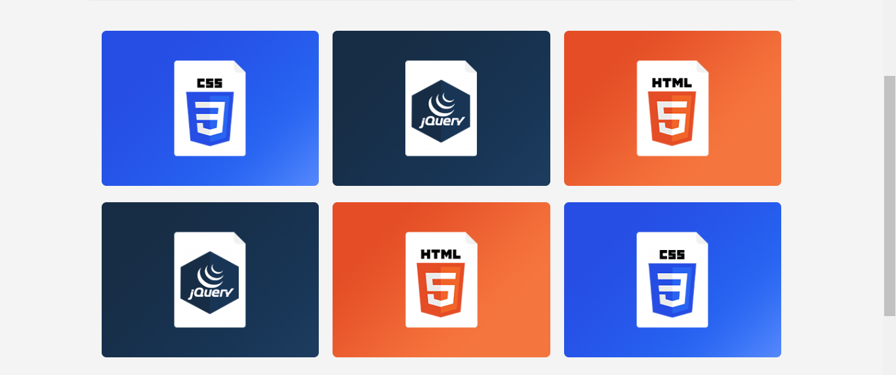

# PORTFOLIO DO LOOPNERD
☑️EXEMPLO DE PORTFOLIO.

   
   

## DESCRIÇÃO:
Este é a estrutura de um site ou página web que apresenta um portfólio responsivo de projetos relacionados a desenvolvimento web, como HTML, CSS e jQuery. Aqui está uma descrição das principais características e funcionalidades do aplicativo:

1. **Meta informações**: O código HTML inclui várias meta tags, como descrição, palavras-chave, autor e outras, que ajudam nos motores de busca e na otimização do site para melhorar sua visibilidade online.

2. **Links para estilos e scripts**: O código inclui links para arquivos CSS e JavaScript externos, que são responsáveis pela estilização e funcionalidade dinâmica do site.

3. **Barra de navegação**: O cabeçalho (`header`) contém o logotipo do site e pode incluir um menu de navegação para ajudar os usuários a navegar pelo site.

4. **Seção de portfólio**: O conteúdo principal (`main_content`) inclue uma seção dedicada ao portfólio, onde diferentes projetos são exibidos em cartões (ou "cards"). Cada cartão possui um título, uma imagem representativa e um link para mais informações sobre o projeto.

5. **Rodapé**: O rodapé (`footer`) inclui informações de direitos autorais e atribuições, além de possivelmente outros links úteis ou informações sobre o site.

## NÃO SABE?
- Entendemos que para manipular arquivos em `HTML`, `CSS` e outras linguagens relacionadas, é necessário possuir conhecimento nessas áreas. Para auxiliar nesse aprendizado, oferecemos cursos gratuitos disponíveis:
* [CURSO DE HTML E CSS](https://github.com/VILHALVA/CURSO-DE-HTML-E-CSS)
* [CURSO DE JAVASCRIPT](https://github.com/VILHALVA/CURSO-DE-JAVASCRIPT)
* [CONFIRA MAIS CURSOS](https://github.com/VILHALVA?tab=repositories&q=+topic:CURSO)

## CREDITOS:
- [PROJETO CRIADO PELO "loopnerd"](https://www.loopnerd.com.br/codigos-css-prontos/portfolio-html-css/)
- [PROJETO EDITADO PELO VILHALVA](https://github.com/VILHALVA)
